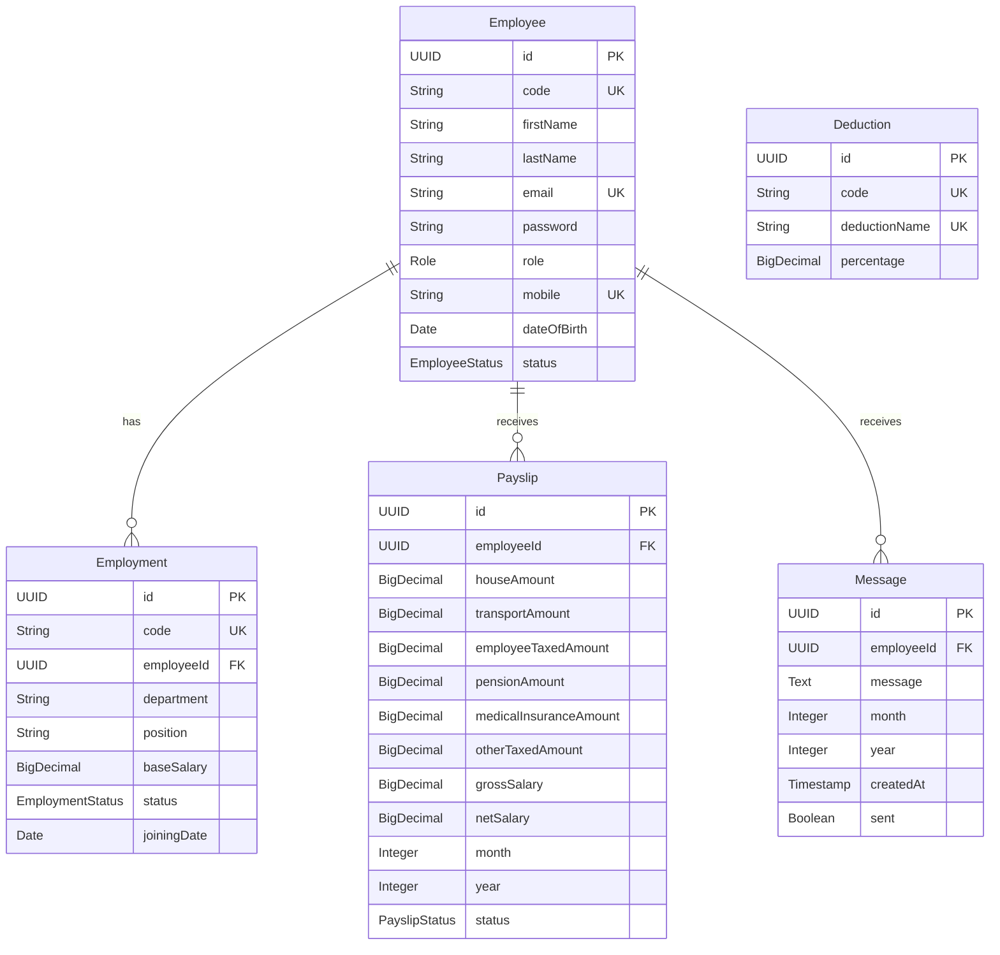

# Rwanda Government ERP System - Entity Relationship Diagram

## Legend
- PK: Primary Key
- FK: Foreign Key
- UK: Unique Key

## Relationships
1. One **Employee** can have multiple **Employments** (One-to-Many)
2. One **Employee** can have multiple **Payslips** (One-to-Many)
3. One **Employee** can have multiple **Messages** (One-to-Many)

## Constraints
- Employee email, mobile, and code must be unique
- Employment code must be unique
- Deduction code and name must be unique
- Payslip must be unique for an employee, month, and year combination